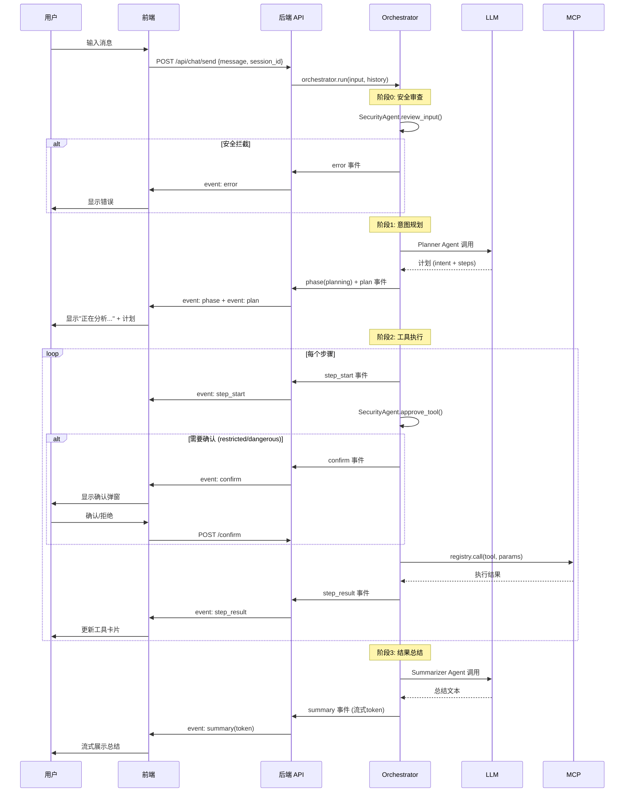
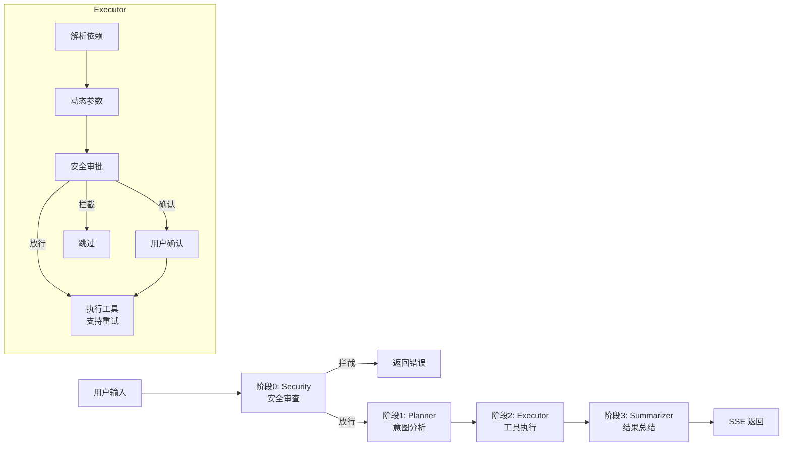
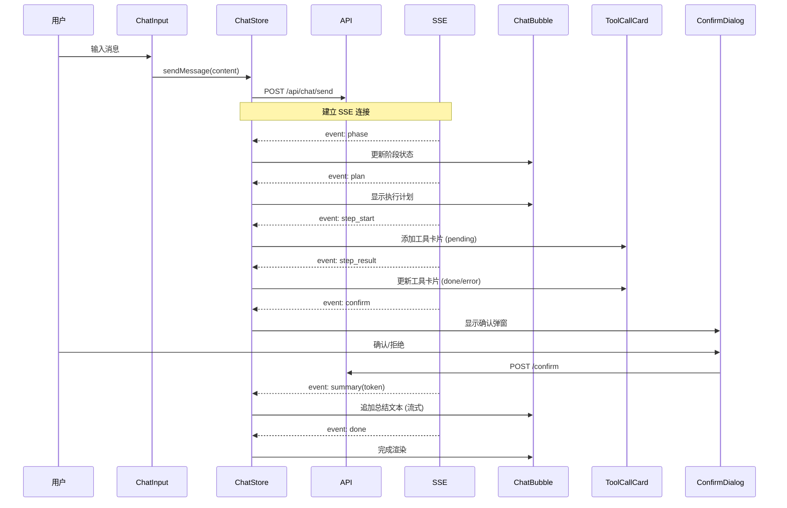

# 软件功能设计文档

> 项目名称：XikiyAIOps — 轻量级智能运维 Agent  
> 版本：v4.2  
> 日期：2026-07-12

---

## 目录

1. [系统架构概述](#1-系统架构概述)
2. [模块划分与职责](#2-模块划分与职责)
3. [后端 API 设计](#3-后端-api-设计)
4. [数据库模型设计](#4-数据库模型设计)
5. [MCP 插件系统设计](#5-mcp-插件系统设计)
6. [Agent 编排系统设计](#6-agent-编排系统设计)
7. [前端功能设计](#7-前端功能设计)
8. [LLM 集成设计](#8-llm-集成设计)
9. [RAG 知识库设计](#9-rag-知识库设计)
10. [安全架构设计](#10-安全架构设计)
11. [部署与配置](#11-部署与配置)

---

## 1. 系统架构概述

### 1.1 整体架构

XikiyAIOps 采用 **前后端分离 + Agent 编排 + MCP 插件** 的架构模式：

```
┌─────────────────────────────────────────────────────┐
│                   用户 (浏览器)                        │
├─────────────────────────────────────────────────────┤
│         Vue 3 + TypeScript + Element Plus             │
│     (Chat / Dashboard / Audit 三大页面)               │
├─────────────────────────────────────────────────────┤
│            HTTP / SSE (Server-Sent Events)            │
├─────────────────────────────────────────────────────┤
│              FastAPI (Python 3.11)                    │
│  ┌──────────┐  ┌──────────────┐  ┌───────────────┐  │
│  │ API 路由 │  │ Orchestrator │  │ SecurityAgent │  │
│  │ (4组)   │  │ (4级流水线)   │  │ (3道安全防线)  │  │
│  └──────────┘  └──────────────┘  └───────────────┘  │
│  ┌──────────────────────────────────────────────┐   │
│  │          MCP 插件注册中心 (82 Tools)          │   │
│  │  15 个插件 · 61 只读 / 13 受限 / 8 高危       │   │
│  └──────────────────────────────────────────────┘   │
│  ┌──────────┐  ┌──────────┐  ┌───────────────────┐ │
│  │ SQLAlchemy│  │ LLM 适配 │  │ RAG 知识库        │ │
│  │ (SQLite/  │  │ (DeepSeek│  │ (TF-IDF/          │ │
│  │  PG)      │  │ /Ollama) │  │  sentence-tr.)    │ │
│  └──────────┘  └──────────┘  └───────────────────┘ │
├─────────────────────────────────────────────────────┤
│                 Linux 服务器 (目标主机)               │
│    systemd · procfs · sysfs · journald · auditd     │
└─────────────────────────────────────────────────────┘
```

### 1.2 技术栈

| 层次 | 技术 | 用途 |
|------|------|------|
| 前端框架 | Vue 3 + TypeScript + Vite | SPA 应用 |
| UI 组件 | Element Plus | 对话框、表单等 |
| 图表 | ECharts | 仪表盘可视化 |
| 状态管理 | Pinia | 前端状态管理 |
| 路由 | Vue Router (Hash) | 页面路由 |
| 后端框架 | FastAPI (Python 3.11) | HTTP API + SSE |
| ORM | SQLAlchemy (async) | 数据库操作 |
| 数据库 | SQLite | 持久化 |
| LLM 适配 | 多 Provider 适配层 | DeepSeek / Ollama |
| 嵌入模型 | sentence-transformers / numpy TF-IDF | RAG 向量化 |
| 架构模式 | MCP (Model Context Protocol) | 插件系统 |

### 1.3 架构设计原则

1. **插件化** — 所有运维能力通过 MCP 插件注册，新增能力不修改核心代码
2. **分层安全** — 正则签名 → LLM 语义审查 → 权限审批，三层安全防线
3. **流式体验** — 全链路 SSE 推送，前端实时展示 Agent 思考过程
4. **SQLite 优先** — 单文件 SQLite 起步，零配置启动
5. **LoongArch 兼容** — 全平台 numpy TF-IDF 回落，国产化无额外依赖

---

## 2. 模块划分与职责

### 2.1 模块全景

```
backend/
├── app/
│   ├── main.py              # FastAPI 应用入口 + 健康检查 + Metrics
│   ├── db.py                # 数据库引擎 + 会话管理 + 迁移
│   ├── models/              # SQLAlchemy 数据模型
│   │   ├── base.py          # 模型基类
│   │   ├── _utils.py        # UUID / 时间工具
│   │   ├── conversation.py  # 对话记录
│   │   ├── audit_log.py     # 审计日志
│   │   └── alert.py         # 告警
│   ├── api/                 # HTTP API 路由
│   │   ├── chat.py          # 聊天 SSE + 历史
│   │   ├── audit.py         # 审计 CRUD
│   │   ├── alerts.py        # 告警 CRUD
│   │   └── system.py        # 系统快照 + 健康评分
│   ├── agents/              # Agent 编排系统
│   │   ├── orchestrator.py  # 三阶段流水线编排器
│   │   ├── security.py      # 安全审计
│   │   ├── base.py          # Agent 基类
│   │   ├── planner.py       # Planner Agent
│   │   ├── executor.py      # Executor Agent
│   │   ├── summarizer.py    # Summarizer Agent
│   │   └── types.py         # 步骤结果类型定义
│   ├── mcp_plugins/         # MCP 运维插件集 (15 插件, 82 Tool)
│   │   ├── base.py          # MCPTool 定义 + MCPPluginRegistry 注册中心
│   │   ├── _common.py       # 共享工具: make_response, run_command, sanitize
│   │   ├── __init__.py      # 导出 registry, MCPTool, RiskLevel
│   │   ├── process_plugin.py
│   │   ├── disk_plugin.py
│   │   ├── memory_plugin.py
│   │   ├── network_plugin.py
│   │   ├── security_plugin.py
│   │   ├── system_plugin.py
│   │   ├── container_plugin.py
│   │   ├── health_config_plugin.py
│   │   ├── rag_plugin.py
│   │   ├── threat_hunt_plugin.py
│   │   ├── ops_plugin.py
│   │   ├── service_plugin.py
│   │   ├── config_plugin.py
│   │   ├── network_security_ops.py
│   │   └── user_pkg_plugin.py
│   ├── llm/                 # LLM 适配层
│   │   ├── config.py        # LLM 配置管理 (llm_config.json)
│   │   ├── providers.py     # Provider 抽象 + 实现
│   │   └── tools.py         # Tool Schema 转换
│   ├── rag/                 # RAG 知识库
│   │   ├── config.py
│   │   ├── models.py        # EmbeddingModel + VectorStore
│   │   ├── tokenizer.py     # 中文分词
│   │   └── builder.py       # 知识库构建
│   ├── core/                # 核心工具
│   │   ├── intent_filter.py # 越狱签名检测
│   │   ├── platform_detect.py
│   │   └── response.py
│   └── services/            # 服务层
│       └── audit_writer.py  # 审计日志写入
```

```
frontend/
├── src/
│   ├── main.ts              # Vue 应用入口
│   ├── App.vue              # 根组件 (侧边栏 + 主区域 + 离线提示)
│   ├── style.css            # 全局样式 + CSS 变量
│   ├── router/
│   │   └── index.ts         # 路由定义 (3 条)
│   ├── types/
│   │   └── index.ts         # TypeScript 类型定义
│   ├── api/
│   │   ├── client.ts        # HTTP 客户端 (GET/POST + 超时 + 错误处理)
│   │   ├── chat.ts          # 聊天 API
│   │   ├── system.ts        # 系统 API
│   │   ├── llmConfig.ts     # LLM 配置 API
│   │   └── audit.ts         # 审计 API
│   ├── stores/
│   │   ├── chat.ts          # 聊天状态 (Pinia)
│   │   ├── system.ts        # 系统状态 (Pinia)
│   │   └── audit.ts         # 审计状态 (Pinia)
│   ├── views/
│   │   ├── ChatView.vue     # 智能对话页
│   │   ├── DashboardView.vue# 仪表盘页
│   │   ├── AuditLogView.vue # 审计日志页
│   │   └── SettingsView.vue # 模型配置页 (预设管理 + 可行性检测)
│   └── components/
│       ├── common/
│       │   ├── AppSidebar.vue     # 左侧导航栏
│       │   └── SystemOverview.vue # 系统概览指示器
│       ├── chat/
│       │   ├── ChatBubble.vue     # 消息气泡
│       │   ├── ChatInput.vue      # 输入框
│       │   ├── ToolCallCard.vue   # 工具调用卡片 (含摘要提取器)
│       │   ├── ConfirmDialog.vue  # 高危操作确认弹窗
│       │   └── HistoryPanel.vue   # 历史会话列表
│       ├── dashboard/
│       │   ├── CpuMemoryPanel.vue # CPU 仪表 + 内存/swap 条
│       │   ├── DiskPanel.vue      # 磁盘使用率柱状图
│       │   ├── NetworkPanel.vue   # 网络连接/端口/重传
│       │   ├── SecurityAlertsPanel.vue # 安全告警列表
│       │   └── HealthScorePanel.vue    # 健康评分
│       └── audit/
│           ├── AuditFilter.vue    # 审计筛选器
│           ├── AuditTimeline.vue  # 审计时间线
│           └── AuditDetail.vue    # 审计详情 (5 阶段)
```

### 2.2 模块职责矩阵

| 模块 | 职责 | 关键依赖 |
|------|------|----------|
| `main.py` | 应用初始化、路由注册、静态文件挂载、健康检查、Metrics | 所有 API 模块 |
| `db.py` | 异步引擎创建、会话管理、自动迁移 | SQLAlchemy, aiosqlite |
| `models/` | 数据模型定义、表结构 | SQLAlchemy |
| `api/` | HTTP 接口、请求验证、响应组装 | db.py, agents/, mcp_plugins/ |
| `agents/` | Agent 编排、安全审查、意图规划、工具执行、结果总结 | llm/, mcp_plugins/ |
| `mcp_plugins/` | 运维工具实现、命令执行、安全护栏、响应脱敏 | _common.py |
| `llm/` | LLM Provider 抽象、Tool Schema 转换 | httpx |
| `rag/` | 知识库构建、向量检索、多后端嵌入 | numpy, sentence-transformers |
| 前端 | UI 展示、SSE 消费、状态管理、可视化 | Vue 3, ECharts, Element Plus |

---

## 3. 后端 API 设计

### 3.1 API 路由总表

| 前缀 | 路由 | 方法 | 功能 | 数据流向 |
|------|------|------|------|----------|
| `/api/chat` | `/send` | POST | 发送消息 (SSE 流式返回) | ChatView → Orchestrator → SSE |
| `/api/chat` | `/history` | GET | 历史会话列表 | ChatView → db |
| `/api/chat` | `/history/{id}` | GET | 单会话消息 | ChatView → db |
| `/api/chat` | `/history/{id}` | DELETE | 删除会话 | ChatView → db |
| `/api/chat` | `/confirm` | POST | 高危操作确认 | ConfirmDialog → Orchestrator |
| `/api/audit` | `/list` | GET | 审计日志分页+筛选 | AuditLogView → db |
| `/api/audit` | `/detail/{id}` | GET | 审计详情 (5 阶段完整数据) | AuditDetail → db |
| `/api/audit` | `/traceback/{session_id}` | GET | 异常回溯链路 | AuditDetail → db |
| `/api/audit` | `/session/{session_id}` | GET | 会话关联审计摘要 | AuditTimeline → db |
| `/api/alerts` | `/list` | GET | 告警列表+筛选 | Dashboard → db |
| `/api/alerts` | `/{id}` | GET | 告警详情+诊断 | Dashboard → db |
| `/api/alerts` | `/{id}/resolve` | POST | 标记告警已修复 | Dashboard → db |
| `/api/system` | `/snapshot` | GET | 系统实时快照 (CPU/内存/磁盘/网络) | 侧边栏/仪表盘 → mcp_plugins |
| `/api/system` | `/health-score` | GET | 健康评分 | Dashboard → health_config_plugin |
| `/api/system` | `/tool-count` | GET | MCP 工具总数 | Dashboard → registry |
| `/health` | `/` | GET | 服务健康检查 (含 LLM 连通性) | 外部监控 |
| `/metrics` | `/` | GET | Prometheus 指标 | Prometheus |

### 3.2 SSE 事件流设计 (`/api/chat/send`)

聊天发送接口采用 **Server-Sent Events** 流式响应，前端通过 `EventSource` 逐个消费事件：



### 3.3 SSE 事件类型

| 事件 | 触发时机 | 数据载荷 |
|------|----------|----------|
| `phase` | 阶段切换 | `{phase, message}` |
| `plan` | Planner 生成计划 | `{intent, strategy, steps[]}` |
| `step_start` | 开始执行某工具 | `{step_id, tool, description}` |
| `step_result` | 工具执行完成 | `{step_id, tool, status, summary, error?}` |
| `confirm` | 需要用户确认 | `{step_id, tool, params, risk, description}` |
| `summary` | 总结阶段 (逐 token) | `{token}` |
| `error` | 发生错误 | `{message}` |
| `done` | 全部完成 | `{session_id}` |

---

## 4. 数据库模型设计

### 4.1 模型关系图

```
Conversation (1) ──────── (N) Message
     │
     │ session_id
     │
AuditLog (N) ←─────────── (──) (从 Message 中提取审计信息)
     │
Alert (N) (独立告警表，不直接关联 Conversation)
```

### 4.2 模型详表

#### `Conversation` — 会话表

| 字段 | 类型 | 说明 |
|------|------|------|
| `id` | String(36), PK | UUID |
| `title` | String(256) | 自动生成的会话标题 |
| `created_at` | DateTime | 创建时间 |
| `updated_at` | DateTime | 最后更新时间 |
| `message_count` | Integer | 消息计数 |

#### `Message` — 消息表

| 字段 | 类型 | 说明 |
|------|------|------|
| `id` | String(36), PK | UUID |
| `conversation_id` | String(36), FK | 关联会话 |
| `role` | String(32) | user / assistant / tool |
| `content` | Text | 消息内容 (JSON) |
| `tool_calls` | JSON | 工具调用记录 |
| `created_at` | DateTime | 创建时间 |

#### `AuditLog` — 审计日志表 (5 阶段闭环)

| 字段 | 类型 | 说明 |
|------|------|------|
| `id` | String(36), PK | UUID |
| `session_id` | String(36), Index | 关联会话 |
| `user` | String(128), Index | 用户 |
| `risk_level` | String(32), Index | read_only / restricted / dangerous |
| `is_anomaly` | Boolean, Index | 是否异常 (v2) |
| `anomaly_type` | String(32), Index | 异常类型 (v2) |
| `timestamp` | DateTime | 审计时间 |
| `input` | JSON | 阶段1: 用户输入 + 时间戳 |
| `perception` | JSON | 阶段2: 感知摘要 (工具数/系统状态) |
| `reasoning` | JSON | 阶段3: 推理过程 (LLM 输出) |
| `validation` | JSON | 阶段4: 安全校验 |
| `execution` | JSON | 阶段5: 执行详情 |

#### `Alert` — 告警表

| 字段 | 类型 | 说明 |
|------|------|------|
| `id` | String(36), PK | UUID |
| `fingerprint` | String(64), Index | Alertmanager 去重指纹 |
| `alert_name` | String(128), Index | 告警名称 |
| `instance` | String(256) | 实例标识 |
| `severity` | String(32) | warning / critical / info |
| `status` | String(32) | firing / resolved |
| `labels` | JSON | Prometheus 标签 |
| `annotations` | JSON | Prometheus 注释 |
| `diagnosis` | JSON | Agent 诊断结果 |
| `resolution` | String(512) | 修复建议 |
| `resolved` | Boolean | 是否已修复 |
| `created_at` | DateTime | 创建时间 |

### 4.3 数据库

- 使用 SQLite (`xikiy_aiops.db`)，零配置启动

---

## 5. MCP 插件系统设计

### 5.1 插件注册中心

采用 **单例模式** 的 `MCPPluginRegistry` 管理所有 Tool：

```python
class MCPTool:          # 工具定义
    name: str           # 工具名 (唯一标识)
    description: str    # LLM 理解的自然语言描述
    handler: callable   # 实际执行函数
    risk_level: enum    # read_only / restricted / dangerous
    parameters: dict    # JSON Schema 参数定义

class MCPPluginRegistry:  # 单例注册中心
    register(tool)        # 注册工具
    get_tool(name)        # 查询工具
    list_all()            # 列出全部 Schema
    list_by_risk(max)     # 按风险过滤
    call(name, **kwargs)  # 统一调用入口 (含权限预检 + 脱敏)
```

### 5.2 风险等级体系

| 等级 | 数量 | 特征 | 示例 |
|------|------|------|------|
| `read_only` | 61 | 只读感知，自动放行 | `system_load`, `disk_inspect`, `network_listening_ports` |
| `restricted` | 13 | 受限操作，需 sudo 组成员 | `service_control`, `ops_cleanup`, `pkg_install` |
| `dangerous` | 8 | 危险操作，需用户二次确认 | `process_kill`, `ops_exec`, `user_delete` |

### 5.4 Tool Schema 增强 (v4.2)

#### required 字段

`MCPTool` 支持 `required` 参数，在 `inputSchema` 中声明必填字段：

```python
reg.register(MCPTool(
    name="logrotate_force",
    parameters={"path": {"type": "string", "description": "日志文件路径"}},
    required=["path"],  # LLM 客户端层强制校验, 防止漏传
))
```

涉及工具: `file_identify`, `file_read`, `file_truncate`, `logrotate_force` — 4 个 path 必填工具。

#### status 响应字段

所有工具响应统一包含 `status` 字段，帮助 LLM 明确区分成败：

| status | 含义 | 来源 |
|--------|------|------|
| `ok` | 执行成功 | `make_response()` |
| `error` | 执行失败 (参数错误/命令异常) | `error_response()` |
| `blocked` | 安全护栏拦截 (权限不足) | `registry.call()` |

```json
{"tool":"disk_cleanup","status":"ok","data":{...},"summary":{...}}
{"tool":"logrotate_force","status":"error","summary":{"error":"文件不存在"}}
```

#### 命令路径补全

`run_command()` 自动补全 `/usr/sbin` 下的命令（`sysctl`, `aa-status` 等），无需硬编码全路径。

### 5.3 插件功能矩阵

#### 5.3.1 `process_plugin` — 进程管理 (12 Tools)

| 工具 | 风险等级 | 功能 |
|------|----------|------|
| `process_list` | read_only | 列出所有进程 (支持过滤) |
| `process_detail` | read_only | 单个进程详细信息 |
| `process_top_cpu` | read_only | CPU 占用 Top 进程 |
| `process_top_memory` | read_only | 内存占用 Top 进程 |
| `process_inspect` | read_only | 进程画像 (状态/CPU/内存分布) |
| `process_tree` | read_only | 进程树 |
| `process_children` | read_only | 进程子进程列表 |
| `process_fds` | read_only | 进程文件描述符 |
| `process_env` | read_only | 进程环境变量 |
| `process_open_files` | read_only | 进程打开文件列表 |
| `process_kill` | dangerous | 终止进程 |
| `process_signal` | dangerous | 发送任意信号 |

#### 5.3.2 `disk_plugin` — 磁盘管理 (4 Tools)

| 工具 | 风险等级 | 功能 |
|------|----------|------|
| `disk_inspect` | read_only | 磁盘分区使用率 |
| `disk_large_files` | read_only | 大文件扫描 |
| `disk_mount_audit` | read_only | 挂载点审计 |
| `disk_io_stats` | read_only | 磁盘 IO 统计 |

#### 5.3.3 `memory_plugin` — 内存管理 (5 Tools)

| 工具 | 风险等级 | 功能 |
|------|----------|------|
| `memory_info` | read_only | 内存/swap 总览 |
| `memory_top` | read_only | 内存占用 Top 进程 |
| `swap_info` | read_only | Swap 详情 |
| `memory_smaps` | read_only | 进程内存映射 |
| `memory_numa` | read_only | NUMA 内存分布 |

#### 5.3.4 `network_plugin` — 网络诊断 (8 Tools)

| 工具 | 风险等级 | 功能 |
|------|----------|------|
| `network_interfaces` | read_only | 网卡信息 |
| `network_listening_ports` | read_only | 监听端口 |
| `network_connections` | read_only | 连接统计 |
| `network_tcp_retrans` | read_only | TCP 重传率 |
| `network_dns_check` | read_only | DNS 解析检查 |
| `network_bandwidth` | read_only | 实时带宽 |
| `network_traceroute` | read_only | 路由追踪 |
| `network_socket_stats` | read_only | Socket 统计 |

#### 5.3.5 `security_plugin` — 安全审计 (12 Tools)

| 工具 | 风险等级 | 功能 |
|------|----------|------|
| `security_auth_failures` | read_only | 认证失败统计 |
| `security_active_sessions` | read_only | 活跃会话 |
| `security_user_audit` | read_only | 用户安全审计 |
| `security_user_privilege` | read_only | 用户权限检查 |
| `security_suid_scan` | read_only | SUID 文件扫描 |
| `security_crontab_audit` | read_only | 定时任务审计 |
| `security_process_anomaly` | read_only | 异常进程检测 |
| `security_file_anomaly` | read_only | 异常文件检测 |
| `security_listen_anomaly` | read_only | 异常监听检测 |
| `security_port_scan` | read_only | 端口扫描 |
| `security_check_config` | read_only | 安全配置检查 |
| `security_log_audit` | read_only | 日志安全审计 |

#### 5.3.6 `system_plugin` — 系统概览 (10 Tools)

| 工具 | 风险等级 | 功能 |
|------|----------|------|
| `system_info` | read_only | 系统基本信息 |
| `system_load` | read_only | CPU 负载 |
| `system_failed_services` | read_only | 失败服务列表 |
| `system_boot_params` | read_only | 内核启动参数安全检查 |
| `system_package_updates` | read_only | 安全更新检查 |
| `system_entropy` | read_only | 内核熵池 |
| `system_journal_query` | read_only | journald 日志查询 |
| `system_journal_tail` | read_only | journald 实时日志 |
| `system_hardware_info` | read_only | 硬件信息 |
| `system_kernel_params` | read_only | 内核参数 |

#### 5.3.7 操作类插件 (4 插件, 19 Tools)

| 插件 | 工具数 | 风险分布 | 核心功能 |
|------|--------|----------|----------|
| `container_plugin` | 3 | 全部 read_only | Docker/Podman 容器管理 |
| `health_config_plugin` | 2 | 全部 read_only | 健康评分配置 |
| `rag_plugin` | 2 | 全部 read_only | RAG 知识库检索与构建 |
| `threat_hunt_plugin` | 1 | read_only | 威胁狩猎 |
| `ops_plugin` | 6 | 4 restricted + 2 dangerous | 清理/备份/执行 |
| `service_plugin` | 1 | restricted | 服务启停控制 |
| `config_plugin` | 4 | restricted | 配置备份/恢复/对比 |
| `network_security_ops` | 4 | restricted | 防火墙/网络操作 |
| `user_pkg_plugin` | 8 | 4 restricted + 4 dangerous | 用户/包管理 |

### 5.4 安全护栏机制

```
用户的自然语言请求
    │
    ▼
┌─────────────────────────────────────┐
│ 1. 越狱签名检测 (intent_filter.py)  │ ← 正则匹配已知越狱模式 (0.1ms)
│    匹配 ✓ → 拦截                     │
└─────────────────────────────────────┘
    │ 通过
    ▼
┌─────────────────────────────────────┐
│ 2. LLM 语义审查 (SecurityAgent)      │ ← LLM 判断真实意图
│    jailbreak/dangerous → 拦截        │
└─────────────────────────────────────┘
    │ 通过
    ▼
┌─────────────────────────────────────┐
│ 3. 风险等级审批 (approve_tool)       │
│    read_only → 自动放行              │
│    restricted → 需 sudo 组成员       │
│    dangerous → 用户二次确认           │
└─────────────────────────────────────┘
    │ 通过
    ▼
┌─────────────────────────────────────┐
│ 4. 命令白名单 (run_command)          │
│    检查命令是否在白名单内             │
│    拒绝高危参数 (rm -rf /, dd, etc.) │
└─────────────────────────────────────┘
    │ 通过
    ▼
┌─────────────────────────────────────┐
│ 5. 响应脱敏 (sanitize_response)      │
│    IP 脱敏 · 路径脱敏 · 敏感字段精简 │
└─────────────────────────────────────┘
    │
    ▼
    返回前端展示
```

### 5.5 统一响应结构

所有 MCP Tool 的返回遵循统一 JSON 格式：

```json
{
  "tool": "disk_inspect",
  "timestamp": "2026-07-09T12:00:00Z",
  "risk_level": "read_only",
  "data": { /* 工具特定的详细数据 */ },
  "summary": {
    "total_gb": 476.9,
    "usage_percent": 72.3,
    "alert": true,
    "alert_reason": "根分区使用率超过 70%"
  }
}
```

---

## 6. Agent 编排系统设计

### 6.1 四阶段流水线 (v4.0)

采用 **Security → Planner → Executor → Summarizer** 四阶段流水线架构：



### 6.2 Agent 职责矩阵

| Agent | 职责 | 调用的 LLM | 工具 |
|-------|------|-----------|------|
| `SecurityAgent` | 正则签名检测 + LLM 语义审查 + 工具权限审批 | 专有精简 prompt | 无 (纯逻辑) |
| `PlannerAgent` | 分析意图 → 自主选择工具组合 → 生成执行计划 (v4.2: 不照搬场景模板) | 完整 Agent | 全部只读工具 (感知环境) |
| `ExecutorAgent` | 按计划逐步执行 → 依赖解析 → 动态参数 → 重试 | 无需 LLM | 全部 82 个工具 |
| `SummarizerAgent` | 整合结果 → 生成自然语言总结报告 (v4.2: 反幻觉约束) | 完整 Agent | 无 (只读结果) |

### 6.3 执行步骤状态机

```
                     ┌──────────┐
                     │  PENDING  │
                     └────┬─────┘
                          │ 开始执行
                     ┌────▼─────┐
              ┌──────│ RUNNING   │
              │      └────┬─────┘
        依赖失败    ┌─────┴──────┐
              │     │            │
         ┌────▼──┐ ┌▼────────┐  │ 重试
         │SKIPPED│ │ SUCCESS │◄─┘
         └───────┘ └─────────┘
                        │
                   ┌────▼─────┐
                   │  FAILED   │
                   └──────────┘
```

### 6.4 规划原则 (v4.2)

Planner **不再匹配预设场景模板**，改为自由规划：

1. 分析用户原话，提取真正的运维意图
2. 从可用工具清单中自主选择工具组合
3. 考虑工具间依赖关系：前步输出 → 后步输入
4. 优先用只读工具感知，再用受限/危险工具执行
5. 如用户指定了具体工具列表，按指定顺序规划，不自行替换

### 6.5 反幻觉机制 (v4.2)

- **Summarizer** 注入 6 条反幻觉铁律：只引用实际返回值，不编造错误信息，不确定时宁少勿多
- **Executor** 注入如实汇报指令：工具返回什么就记录什么
- 工具响应增加 `status` 字段，LLM 直接读字段判断成败，无需推测

### 6.6 计划格式 (Planner 输出)

```json
{
  "intent": "诊断磁盘使用率过高",
  "strategy": "按顺序执行磁盘检查→大文件定位→进程关联→生成报告",
  "steps": [
    {
      "id": "step_1",
      "tool": "disk_inspect",
      "description": "检查所有分区使用率",
      "params": {},
      "depends_on": [],
      "fallback_tool": null,
      "max_retries": 0
    },
    {
      "id": "step_2",
      "tool": "disk_large_files",
      "description": "扫描根分区大文件",
      "params": {"path": "/", "min_size_mb": 500},
      "depends_on": ["step_1"],
      "fallback_tool": null,
      "max_retries": 1
    }
  ]
}
```

---

## 7. 前端功能设计

### 7.1 页面路由

| 路径 | 页面 | 核心组件 | 功能描述 |
|------|------|----------|----------|
| `/chat` | 智能对话 | ChatBubble, ChatInput, ToolCallCard, ConfirmDialog, HistoryPanel | 与 AI Agent 对话，实时 SSE 展示工具执行过程 |
| `/dashboard` | 仪表盘 | CpuMemoryPanel, DiskPanel, NetworkPanel, SecurityAlertsPanel, HealthScorePanel | 系统状态可视化，健康评分，安全告警 |
| `/audit` | 审计日志 | AuditFilter, AuditTimeline, AuditDetail | 操作审计追踪，5 阶段详情，异常回溯 |

### 7.2 Chat 页面数据流



### 7.3 工具调用卡片 (ToolCallCard)

每条工具调用在前端渲染为一张卡片，包含：

1. **状态指示** — pending(○) / running(◌) / done(●) / error(✕)
2. **工具名 + 风险标签** — 只读/受限/高危
3. **参数摘要** — JSON 格式化显示
4. **结果摘要** — 按工具类型提取关键字段（负载值、使用率、告警等）
5. **原始数据** — 可展开查看完整 JSON

内置 17 种工具类型的专用摘要提取器，覆盖系统负载、内存、磁盘、进程、网络、安全等所有主要工具。

### 7.4 仪表盘可视化

| 面板 | 图表类型 | 数据来源 | 更新策略 |
|------|----------|----------|----------|
| CPU 仪表 | ECharts Gauge + 负载曲线 | systemStore.snapshot | 轮询 (10s) |
| 内存/Swap | 进度条 + 数值 | systemStore.snapshot | 轮询 (10s) |
| 磁盘使用率 | ECharts 柱状图 | systemStore.snapshot | 轮询 (10s) |
| 网络面板 | 端口列表 + 连接数 + 重传率 | systemStore.snapshot | 轮询 (10s) |
| 安全告警 | 表格列表 | systemStore.securityAlerts | 轮询 (10s) |
| 健康评分 | 评分卡片 + 告警列表 | api/system/health-score | 轮询 (30s) |
| 系统概览 | SVGs 环形图 (CPU/内存/磁盘/告警) | systemStore.snapshot | 轮询 (10s) |

### 7.5 审计日志页面

采用 **左列时间线 + 右列详情** 的双栏布局：

- 左栏：可分页的审计日志时间线，支持关键字搜索、风险等级筛选、异常标记筛选
- 右栏：5 阶段审计详情——输入原文 → 感知环境摘要 → 推理决策过程 → 安全校验结果 → 执行详情

### 7.6 前端状态管理 (Pinia Store)

| Store | 状态 | Actions | 用途 |
|-------|------|---------|------|
| `systemStore` | snapshot, securityAlerts, healthScore, loading | fetchSnapshot(), fetchSecurityAlerts(), fetchHealthScore() | 系统数据轮询 |
| `chatStore` | messages[], streaming, pendingTools[], isAwaitingConfirm | sendMessage(), submitDecisions(), loadHistory() | 对话状态管理 |
| `auditStore` | logs[], total, filter, loading | loadLogs(), setFilter(), setPage(), cancelLoading() | 审计分页+筛选 |

---

## 8. LLM 集成设计

### 8.1 Provider 抽象

支持多 LLM Provider 的无缝切换：

```python
# 抽象接口
class LLMProvider:
    async def chat_stream(messages, tools) → AsyncGenerator[Event]
    # 事件类型: token / tool_calls / done

# 实现
class DeepSeekProvider(LLMProvider):   # DeepSeek API (默认)
class OllamaProvider(LLMProvider):     # 本地 Ollama (LoongArch 推荐)
```

### 8.2 Tool Schema 转换

`tools.py` 作为 **单一事实来源**，将 MCP 注册中心的原始 Schema 统一转换为 LLM function calling 格式：

```python
# 原始格式 (from MCPPluginRegistry)
{
  "name": "disk_inspect",
  "description": "检查所有分区使用率",
  "inputSchema": {"type": "object", "properties": {...}},
  "risk_level": "read_only"
}

# 转换后 (给 LLM)
{
  "type": "function",
  "function": {
    "name": "disk_inspect",
    "description": "检查所有分区使用率",
    "parameters": {"type": "object", "properties": {...}}
  }
}
```

### 8.3 配置项

LLM 配置通过前端「模型配置」页面管理，持久化到 `backend/llm_config.json`。

**配置结构**：

```json
{
  "active_preset": "deepseek",
  "presets": {
    "deepseek": {"provider":"deepseek","base_url":"https://api.deepseek.com","model":"deepseek-v4-flash","api_key":"sk-xxx"},
    "custom_abc": {"provider":"openai","base_url":"https://...","model":"...","api_key":"..."}
  }
}
```

**前端预设可用性（feasibility）**：

| 状态 | 条件 | 图标 |
|------|------|------|
| 正常 | 模型在列表中 且 连通测试通过 | 🟢 绿✓ |
| 异常 | 任一条件不满足（非首次配置） | 🔴 红✗ |
| 未配置 | 尚未进行任何检测 | ⬜ 灰○ |

- `api_key` / `base_url` 变更时自动重置连通性状态
- `model` 变更时自动重算模型匹配
- 状态持久化到 localStorage，刷新不丢失

**预设模型**：

| ID | 名称 | Provider | Base URL |
|----|------|----------|----------|
| deepseek | DeepSeek | deepseek | https://api.deepseek.com |
| qwen | Qwen（通义千问）| qwen | https://dashscope.aliyuncs.com/compatible-mode |
| doubao | DoubaoSeed（豆包）| openai | https://ark.cn-beijing.volces.com/api/v3 |

自定义预设支持任意 OpenAI 兼容 API 接入。

---

## 9. RAG 知识库设计

### 9.1 双后端自适应嵌入

| 后端 | 适用平台 | 维度 | 依赖 | 性能 |
|------|----------|------|------|------|
| sentence-transformers | x86_64 (有此包时) | 384 | sentence-transformers + PyTorch | 高精度, 但依赖重 |
| numpy TF-IDF | 全平台 (含 LoongArch) | 768 (max) | 仅 numpy | 零依赖, 毫秒级 |

自动检测逻辑：
1. LoongArch → 跳过 sentence-transformers，直接使用 numpy TF-IDF
2. x86_64 → 优先加载 sentence-transformers，失败回落 numpy TF-IDF
3. 环境变量 `RAG_EMBEDDING_BACKEND=sentence_transformers` 可强制指定

### 9.2 向量存储

- 基于 SQLite 的轻量级向量存储
- 支持余弦相似度搜索
- 分词器支持中文 char n-gram + 英文/数字词
- TF-IDF 词汇表持久化到磁盘 (tfidf_vocab.pkl)

---

## 10. 安全架构设计

### 10.1 三层安全防线

| 层次 | 技术 | 延迟 | 拦截目标 |
|------|------|------|----------|
| L1 正则签名 | `intent_filter.py` | 0.1ms | 已知越狱模式（显式角色劫持等） |
| L2 LLM 语义 | `SecurityAgent._llm_review_input()` | ~500ms | 语义级危险意图（伪装请求等） |
| L3 权限审批 | `SecurityAgent.approve_tool()` | <1ms | 按风险等级分级放行 |

### 10.2 命令执行安全

- **命令白名单** — `_ALLOWED_COMMANDS` 只允许已知安全命令
- **参数拦截** — 拒绝高危参数组合 (`rm -rf /`, `dd if=/dev/zero`, `mkfs` 等)
- **超时控制** — 每个命令有独立的 timeout 参数
- **输出截断** — stdout/stderr 默认限制 500 字符

### 10.3 响应脱敏

- **IP 脱敏** — `192.168.x.x` → `192.168.xx.xx`
- **路径脱敏** — `/home/username/...` → `/home/***/...`
- **敏感字段精简** — 移除 uid/gid 数字、MAC 地址、shell 路径等

### 10.4 服务保护

- 禁止操作关键系统服务：sshd, auditd, systemd-journald, dbus, NetworkManager 等
- 操作前自动记录服务状态，操作后验证状态变更
- `restricted` 级别操作需要 sudo 组成员身份

---

## 11. 部署与配置

### 11.1 部署方式

支持两种部署模式：

```yaml
# 方式一: 源码部署 (开发/调试)
backend:
  启动: uvicorn app.main:app --host 0.0.0.0 --port 8000
  依赖: pip install -r requirements.txt
  数据库: SQLite (自动创建)

frontend:
  构建: npm run build (输出到 frontend/dist/)
  开发: npm run dev (端口 5173, 代理到后端 8000)

# 方式二: Systemd 生产部署
service: xikiy-aiops
路径: /opt/xikiy-aiops/
启动: systemctl start xikiy-aiops
```

### 11.2 配置管理

**LLM 配置**：通过前端「模型配置」页面管理，持久化到 `backend/llm_config.json`。

**环境变量**（`backend/.env`）：

| 变量 | 默认值 | 说明 |
|------|--------|------|
| `DATABASE_URL` | `sqlite+aiosqlite:///xikiy_aiops.db` | 数据库连接串 |
| `RAG_EMBEDDING_BACKEND` | `auto` | RAG 嵌入后端 |
| `RAG_DB_DIR` | `./rag_db` | RAG 数据目录 |

### 11.3 硬件兼容性

| 架构 | 状态 | 说明 |
|------|------|------|
| x86_64 | ✅ 完整支持 | sentence-transformers + ECharts 全功能 |
| LoongArch64 | ✅ 完整支持 | numpy TF-IDF 回落，零额外依赖 |
| ARM64 | ✅ 完整支持 | 同等 LoongArch 策略 |

---
