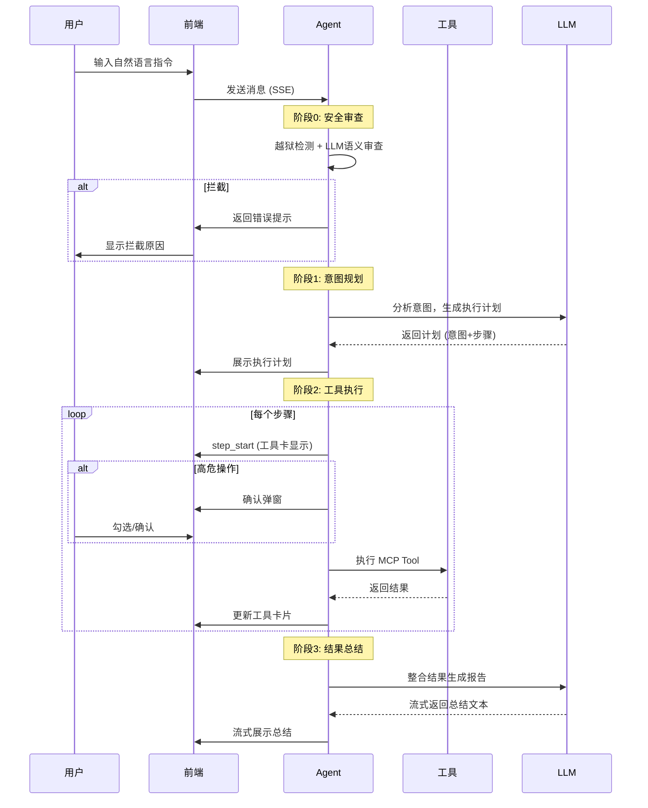

# XikiyAIOps 产品说明书

> 版本：v4.2 | 最后更新：2026-07-12

---

## 目录

1. [产品概述](#1-产品概述)
2. [系统要求](#2-系统要求)
3. [快速安装](#3-快速安装)
4. [初次使用](#4-初次使用)
5. [功能详解](#5-功能详解)
6. [管理运维](#6-管理运维)
7. [常见问题](#7-常见问题)
8. [附录](#8-附录)

---

## 1. 产品概述

### 1.1 产品定位

XikiyAIOps 是一款**轻量级、面向单机运维场景**的智能运维 Agent。它以自然语言作为交互界面，通过 82 个 MCP（Model Context Protocol）运维工具封装 Linux 服务器全部运维能力，让运维工程师用"说话"代替"敲命令"。

### 1.2 核心能力

| 能力 | 说明 |
|------|------|
| **系统感知** | CPU、内存、磁盘、网络、进程、日志、容器全维度实时感知 |
| **智能诊断** | Agent 动态编排诊断链路（不依赖预设场景模板），多维度数据聚合分析，定位根因 |
| **安全操作** | 文件清理、服务控制、包管理、配置管理等运维操作，带安全护栏 |
| **安全审计** | 5 阶段全链路审计日志，操作可追溯、异常可回溯 |
| **健康监控** | 综合健康评分（0-100）+ Prometheus 指标导出 |
| **知识增强** | RAG 知识库检索，运维知识可持续积累 |

### 1.3 产品架构

```
┌──────────────────────────────────────────────────┐
│                 Web 浏览器 (用户界面)               │
│   ┌──────────┐  ┌──────────┐  ┌──────────────┐  │
│   │ 智能对话  │  │  仪表盘   │  │  审计日志    │  │
│   └──────────┘  └──────────┘  └──────────────┘  │
├──────────────────────────────────────────────────┤
│   XikiyAIOps 服务 (后端)                          │
│   ┌─────────┐  ┌────────────┐  ┌─────────────┐  │
│   │ Agent   │  │ 安全护栏   │  │ RAG 知识库  │  │
│   │ 编排引擎 │  │ 3 层过滤   │  │ 向量检索    │  │
│   └────┬────┘  └────────────┘  └─────────────┘  │
│        ▼                                         │
│   ┌──────────────────────────────────────────┐   │
│   │       82 个 MCP 运维工具                 │   │
│   │  进程 · 磁盘 · 内存 · 网络 · 安全 · 系统  │   │
│   │  容器 · 服务 · 配置 · 用户 · 包管理       │   │
│   └──────────────────────────────────────────┘   │
├──────────────────────────────────────────────────┤
│               被管理服务器 (Linux)                │
│   systemd · procfs · journald · auditd · iptables │
└──────────────────────────────────────────────────┘
```

---

## 2. 系统要求

### 2.1 硬件要求

| 配置项 | 最低要求 | 推荐配置 |
|--------|----------|----------|
| CPU | 2 核 | 4 核及以上 |
| 内存 | 2 GB | 4 GB 及以上 |
| 磁盘 | 5 GB 可用空间 | 20 GB 及以上（含日志存储） |
| 架构 | x86_64 / LoongArch64 / ARM64 | — |

### 2.2 软件要求

| 软件 | 版本要求 | 说明 |
|------|----------|------|
| 操作系统 | Linux (麒麟 V10/V11、Ubuntu 20.04+、Debian 11+、CentOS 8+) | - |
| Python | 3.10+ | 推荐 3.11 |
| LLM API | DeepSeek API Key | - |

### 2.3 网络要求

| 方向 | 协议 | 端口 | 说明 |
|------|------|------|------|
| 入站 | HTTP | 8001 | Web 管理界面 + API |
| 出站 | HTTPS | 443 | LLM API 调用（默认 DeepSeek） |
| 可选 | HTTP | 9090 | Prometheus（可选监控组件） |

---

## 3. 快速安装

### 3.1 一键部署

在目标服务器上执行以下命令：

```bash
# 1. 解压安装包
tar xzf XikiyAIOps_v1.2.0.tar.gz
cd XikiyAIOps_v1.2.0

# 2. 执行一键部署
bash scripts/deploy.sh

# 3. 启动服务
bash scripts/start.sh
```

部署脚本会自动完成以下步骤：

| 步骤 | 操作 | 说明 |
|------|------|------|
| Step 1 | 环境检测 | 检测 OS、架构、包管理器 |
| Step 2 | 系统依赖安装 | Python 3.11、编译工具链、Node.js |
| Step 3 | Python 虚拟环境 | 创建 `.venv`，安装 `requirements.txt` |
| Step 4 | MCP 插件注册验证 | 验证 82 个工具全部注册成功 |
| Step 5 | 前端构建 | `npm run build` 构建 Vue 3 SPA |
| Step 6 | 数据库初始化 | 自动创建 SQLite 数据库及表结构 |

### 3.2 手动部署

如需分步执行：

```bash
# 后端
cd backend
python3 -m venv .venv
source .venv/bin/activate
pip install -r requirements.txt
uvicorn app.main:app --host 0.0.0.0 --port 8001
# 启动后在前端「模型配置」页面设置 LLM 模型和 API Key

# 前端（开发模式）
cd frontend
npm install
npm run dev            # 默认 http://localhost:5173

# 前端（生产模式）
npm run build          # 输出到 frontend/dist/
# 后端会自动挂载 dist/，合一访问
```

### 3.3 LoongArch 离线安装

麒麟 LoongArch64 架构支持全离线安装：

```bash
# 1. 解压离线包
tar xzf XikiyAIOps_v1.2.0.tar.gz
cd XikiyAIOps_v1.2.0

# 2. deploy 脚本会自动检测 loongarch64 架构
#    - 从 offline-packages/rpms.tar.gz 安装系统 RPM
#    - 从 offline-packages/wheels-loongarch64.tar.gz 安装 Python 包
#    - 从 offline-packages/rust-loongarch64.tar.gz 恢复 Rust 工具链
bash scripts/deploy.sh

# 3. 启动服务
bash scripts/start.sh
```

### 3.4 模型配置

LLM 模型和 API Key 通过前端「模型配置」页面管理（侧边栏 → 模型配置）：

**预设模型**：点击卡片即可切换，支持 DeepSeek / 通义千问 / 豆包 三个内置预设。

**自定义 Provider**：点击「添加自定义 Provider」接入任意 OpenAI 兼容 API，支持管理模式下删除。

**配置步骤**：
1. 选择预设模型或创建自定义 Provider
2. 输入 API Key（留空则保持已有密钥）
3. 填写 API 请求地址
4. 点击「获取模型列表」拉取可用模型，或手动输入模型名称
5. 点击「保存配置并使用」— 自动执行连通性 + 模型匹配验证
6. 查看预设卡片上的可行性徽章：
   - 🟢 **正常** — 模型可用，连通正常
   - 🔴 **异常** — 需检查配置
   - ⬜ **未配置** — 尚未验证

> 也可以先点「连通测试」单独验证，再保存。

#### 环境变量（自动化部署场景）

如需在部署时预设 LLM 配置，使用环境变量：

```bash
SRE_LLM_PROVIDER=deepseek SRE_LLM_API_KEY=sk-xxx bash scripts/deploy.sh
```

### 3.5 验证安装

部署完成后，访问以下地址确认服务正常运行：

| 地址 | 检查内容 |
|------|----------|
| `http://<服务器IP>:8001/` | Web 管理界面 |
| `http://<服务器IP>:8001/health` | 健康检查（含 LLM 连通性） |
| `http://<服务器IP>:8001/docs` | Swagger API 文档 |

健康检查返回示例：

```json
{
  "status": "ok",
  "service": "xikiy-aiops",
  "llm": "ok",
  "llm_detail": "HTTP 200"
}
```

---

## 4. 初次使用

### 4.1 登录与首页

> XikiyAIOps 为内网运维工具，当前版本**不设独立登录认证**，打开浏览器访问即可使用。

打开浏览器访问 `http://<服务器IP>:8001/`，默认进入**智能对话**页面。

页面布局：

```
┌──────────────┬──────────────────────────────────────┐
│              │                                      │
│   侧边栏     │         主区域（当前页面）             │
│              │                                      │
│  🗨 智能对话  │                                      │
│  📊 仪表盘   │                                      │
│  📋 审计日志  │                                      │
│              │                                      │
│  系统概览     │                                      │
│  CPU MEM     │                                      │
│  DISK 告警   │                                      │
│              │                                      │
└──────────────┴──────────────────────────────────────┘
```

- **左侧导航**：切换三个核心页面
- **底部系统概览**：实时 CPU/内存/磁盘使用率 + 安全告警数
- **离线提示**：浏览器检测到网络断开时自动显示红色条

### 4.2 第一次对话

进入**智能对话**页面，在底部输入框中输入一条自然语言指令，例如：

> "查看系统状态"

系统将依次执行：

```
Step 1: 安全审查 → 通过
Step 2: Agent 分析意图 → 自主选择工具组合（不匹配预设场景）
Step 3: 动态生成执行计划
  ├── system_info → 获取系统基本信息
  ├── system_load → 获取 CPU 负载
  ├── memory_info → 获取内存使用
  ├── disk_inspect → 获取磁盘使用率
  ├── system_failed_services → 检查失败服务
  └── security_auth_failures → 检查安全告警
Step 4: 总结 → 生成综合报告
```

执行过程中，每个工具的调用情况会以**工具卡片**的形式实时展示，包含参数、结果摘要和状态指示。

### 4.3 推荐的起始指令

| 指令 | 用途 | 涉及工具数 |
|------|------|-----------|
| "查看系统状态" | 系统概览 | 5-6 |
| "查看磁盘使用情况" | 磁盘巡检 | 3-4 |
| "检查系统安全" | 安全审计 | 5-8 |
| "CPU 为什么这么高" | 性能诊断 | 4-6 |
| "清理系统垃圾" | 运维操作（需确认） | 3-4 |
| "查看监听端口" | 网络检查 | 2-3 |

---

## 5. 功能详解

### 5.1 智能对话

智能对话是产品的核心交互界面，用户通过自然语言与 AI Agent 对话，完成系统感知、故障诊断、运维操作等任务。

#### 5.1.1 工作流程



#### 5.1.2 消息气泡

聊天区域的消息分为三种类型：

| 角色 | 样式 | 内容 |
|------|------|------|
| **用户** | 右对齐，蓝色主题 | 用户的自然语言指令 |
| **助手** | 左对齐，白色卡片 | Agent 的回复（Markdown 渲染） |
| **工具调用** | 嵌入式折叠卡片 | 每个工具的执行情况 |

#### 5.1.3 工具调用卡片

在执行阶段，每调用一个工具会生成一张工具卡片，包含：

| 卡片元素 | 说明 |
|----------|------|
| 状态图标 | `○` 等待 / `◌` 执行中 / `●` 完成 / `✕` 失败 |
| 工具名称 | 如 `disk_inspect`、`system_load` |
| 风险标签 | `只读` / `受限` / `高危`（带颜色标识） |
| 参数摘要 | 工具的输入参数，可展开查看 JSON |
| 结果摘要 | 按工具类型智能提取关键字段（如负载值、使用率、告警等） |
| 原始数据 | 可展开查看完整 JSON 返回 |

#### 5.1.4 高危操作确认

当 Agent 需要执行 `dangerous` 级别的工具时，前端会弹出确认对话框：

- 显示所有待确认的高危操作列表
- 每条操作包含：工具名、风险等级、操作描述、参数详情
- 支持**勾选/取消**单个操作、**全选/取消全选**
- 点击"确认执行"已选操作，或"取消"全部拒绝

需要确认的操作示例：

| 操作 | 风险等级 | 确认原因 |
|------|----------|----------|
| 终止进程 (process_kill) | 高危 | 可能导致服务中断 |
| 删除用户 (user_delete) | 高危 | 不可逆操作 |
| 安装包 (pkg_install) | 受限 | 系统变更操作 |
| 重启服务 (service_control) | 受限 | 可能影响业务 |

### 5.2 仪表盘

仪表盘提供系统运行状态的可视化总览。

#### 5.2.1 系统概览

| 指标 | 可视化方式 | 告警阈值 |
|------|-----------|----------|
| CPU 负载 | ECharts 仪表盘 + 实时曲线 | Load > 70% 警告 / > 90% 危险 |
| 内存使用 | 进度条 + 数值 | > 80% 警告 / > 90% 危险 |
| Swap 使用 | 进度条 + 数值 | > 50% 警告 / > 80% 危险 |
| 磁盘使用率 | ECharts 柱状图 | > 70% 警告 / > 90% 危险 |
| 网络连接 | 端口列表 + 连接数统计 | — |
| 安全告警 | 表格列表 | 存在认证失败/异常会话时 |

#### 5.2.2 健康评分

综合健康评分（0-100 分），基于以下维度加权计算：

| 维度 | 权重 | 数据来源 |
|------|------|----------|
| CPU 负载 | 20% | `system_load` 工具 |
| 内存使用 | 20% | `memory_info` 工具 |
| 磁盘使用 | 20% | `disk_inspect` 工具 |
| 安全状态 | 20% | `security_auth_failures` / `security_active_sessions` |
| 服务状态 | 20% | `system_failed_services` / `system_package_updates` |

评分区间：

| 区间 | 等级 | 含义 |
|------|------|------|
| 90-100 | 优秀 | 系统健康 |
| 70-89 | 良好 | 存在轻微风险 |
| 50-69 | 警告 | 需要关注 |
| 0-49 | 危险 | 需要立即处理 |

#### 5.2.3 数据刷新

仪表盘数据自动轮询刷新：
- 系统快照：每 10 秒
- 健康评分：每 30 秒
- 安全告警：每 10 秒

### 5.3 审计日志

审计日志记录每一次 Agent 操作的完整 5 阶段信息，用于安全审计和事后追溯。

#### 5.3.1 5 阶段审计闭环

| 阶段 | 名称 | 记录内容 |
|------|------|----------|
| 1 | input（输入） | 用户原始指令 + 时间戳 + 用户标识 |
| 2 | perception（感知） | 工具调用摘要 + 系统快照摘要 |
| 3 | reasoning（推理） | LLM 推理过程 + 计划工具调用 |
| 4 | validation（校验） | 安全规则命中 + 风险评分 + 审批决策 |
| 5 | execution（执行） | 实际执行命令 + 退出码 + 输出 + 耗时 |

#### 5.3.2 日志筛选

| 筛选维度 | 说明 |
|----------|------|
| 关键字搜索 | 按指令内容 / 工具名 / 用户名搜索 |
| 风险等级筛选 | 全部 / 只读 / 受限 / 高危 |
| 异常标记筛选 | 仅显示异常记录（安全拦截 / 工具报错 / 越狱拦截等） |

#### 5.3.3 异常回溯

对于标记为异常的审计记录，提供**异常回溯**功能：
- 展示异常发生的时间线
- 关联同一会话的所有操作
- 标注异常原因分类（安全拦截 / 工具报错 / 越狱拦截 / 注入拦截 / 危险操作拦截）

---

## 6. 管理运维

### 6.1 服务管理

根据部署方式不同，有两种管理方式：

#### 方式一：源码部署（`deploy.sh` / `start.sh`）

```bash
# 启动（前台，Ctrl+C 停止）
bash scripts/start.sh

# 或直接启动后端
cd backend
source .venv/bin/activate
uvicorn app.main:app --host 0.0.0.0 --port 8001
```

#### 方式二：.deb 包安装（含 systemd 服务注册）

| 操作 | 命令 | 说明 |
|------|------|------|
| 启动 | `sudo systemctl start xikiy-aiops` | 启动后端服务 |
| 停止 | `sudo systemctl stop xikiy-aiops` | 停止后端服务 |
| 重启 | `sudo systemctl restart xikiy-aiops` | 重启后端服务 |
| 状态 | `systemctl status xikiy-aiops` | 查看服务状态 |
| 日志 | `sudo journalctl -u xikiy-aiops -f` | 查看实时日志 |
| CLI 管理 | `sudo xikiy-aiops <命令>` | 内置 CLI 工具（config/start/stop/restart/status/logs） |

### 6.2 健康检查

```bash
# 服务健康状态
curl http://localhost:8001/health

# 返回示例
{
  "status": "ok",
  "service": "xikiy-aiops",
  "llm": "ok",
  "llm_detail": "HTTP 200",
  "uptime": "3d 12h 34m"
}
```

### 6.3 监控集成（Prometheus）

服务在 `/metrics` 端点暴露 Prometheus 格式指标：

| 指标名 | 类型 | 说明 |
|--------|------|------|
| `xikiy_aiops_uptime_seconds` | Gauge | 服务运行时长 |
| `xikiy_aiops_tool_count` | Gauge | MCP 工具注册总数 |
| `xikiy_aiops_cpu_percent` | Gauge | 进程 CPU 使用率 |
| `xikiy_aiops_memory_usage_bytes` | Gauge | 进程内存使用量 |
| `xikiy_aiops_disk_usage_bytes` | Gauge | 根分区磁盘使用量 |

Prometheus 配置示例（`prometheus/prometheus.yml`）：

```yaml
scrape_configs:
  - job_name: 'xikiy-aiops'
    scrape_interval: 15s
    static_configs:
      - targets: ['localhost:8001']
```

### 6.4 数据管理

| 数据类型 | 位置 | 管理建议 |
|----------|------|----------|
| SQLite 数据库 | `backend/xikiy_aiops.db` | 定期备份 |
| RAG 知识库 | `backend/rag_db/` | 包含向量索引和词汇表 |
| 审计日志 | 数据库内 `audit_logs` 表 | 定期归档清理 |
| 应用日志 | 源码: 终端 stdout<br>systemd: `journalctl -u xikiy-aiops` | 部署方式决定查看方式 |

### 6.5 前端更新

前端构建产物更新：

```bash
cd frontend
npm install
npm run build
# 构建完成后，后端 FastAPI 会自动挂载新的 dist/
# 如使用 systemd 部署:
# sudo systemctl restart xikiy-aiops
# 如使用源码部署:
# 重启 start.sh 或手动重启 uvicorn 进程
```

### 6.6 备份与恢复

```bash
# 备份数据库
cp backend/xikiy_aiops.db backend/xikiy_aiops.db.bak.$(date +%Y%m%d)

# 备份知识库
cp -r backend/rag_db backend/rag_db.bak.$(date +%Y%m%d)

# 恢复
cp backend/xikiy_aiops.db.bak.20260709 backend/xikiy_aiops.db
```

---

## 7. 常见问题

### Q1：启动后无法访问页面

**可能原因：**
1. 端口被占用 → 检查 `ss -ltnp | grep 8001`
2. 前端未构建 → 确认 `frontend/dist/index.html` 存在
3. 防火墙未放行 → `sudo firewall-cmd --add-port=8001/tcp`（CentOS/RHEL）或 `sudo ufw allow 8001`（Ubuntu/Debian）

### Q2：对话返回"LLM 连接失败"

**排查步骤：**
1. 在前端「模型配置」页面检查 API Key 是否已设置，可点击「连通测试」验证
2. 检查服务能否连通 LLM API：`curl https://api.deepseek.com/models`
3. 查看后端日志：源码部署查看终端输出；systemd 部署执行 `journalctl -u xikiy-aiops -f`
4. 若使用 Ollama：确认 Ollama 服务运行中且模型已拉取

### Q3：工具执行报错"命令被安全护栏拦截"

**原因：** 执行的命令不在 MCP 插件的命令白名单中。

**处理：**
- 尝试使用更安全的等效操作
- 视为设计约束，不绕过安全护栏
- 如需新增白名单命令，请联系管理员评估风险后修改 `_common.py`

### Q4：高危操作弹窗没有弹出

**可能原因：**
1. 浏览器弹窗被拦截 → 检查浏览器设置
2. 网络延迟导致 SSE 连接异常 → 刷新页面重试
3. 工具实际风险等级为 `read_only` → 此类操作自动放行，无需确认

### Q5：仪表盘显示"暂无系统数据"

**可能原因：**
1. 首次启动后还未发生对话 → 前往智能对话输入"查看系统状态"
2. 后端 API 连接异常 → 检查 `/api/system/snapshot` 是否正常返回

### Q6：数据库文件在哪里？

SQLite 数据库文件位置：

```bash
# 默认路径
backend/xikiy_aiops.db

# 生产部署路径
/opt/xikiy-aiops/backend/xikiy_aiops.db
```

如需迁移数据，直接拷贝该文件即可。**当前版本仅支持 SQLite**，暂未适配其他数据库。

### Q7：如何更新 MCP 工具数量？

MCP 工具在插件注册时自动统计。验证已注册工具数：

```bash
cd backend
source .venv/bin/activate
python -c "from app.mcp_plugins.base import registry; print(registry.count)"
```

### Q8：LoongArch 上某些包安装失败

LoongArch 的 wheel 包需要从源码编译，确保已安装：

```bash
# 麒麟 V10/V11
sudo dnf install -y gcc gcc-c++ make python3-devel gcc-gfortran cmake
```

如果仍有失败，检查 `offline-packages/wheels-loongarch64.tar.gz` 是否包含该包的 `.whl` 文件。

---

## 8. 附录

### 8.1 MCP 工具完整清单

| 插件 | 工具名 | 风险等级 | 功能 |
|------|--------|----------|------|
| process | `process_list` | 只读 | 列出所有进程 |
| process | `process_detail` | 只读 | 进程详细信息 |
| process | `process_top_cpu` | 只读 | CPU Top 进程 |
| process | `process_top_memory` | 只读 | 内存 Top 进程 |
| process | `process_inspect` | 只读 | 进程画像 |
| process | `process_tree` | 只读 | 进程树 |
| process | `process_children` | 只读 | 进程子进程 |
| process | `process_fds` | 只读 | 文件描述符 |
| process | `process_env` | 只读 | 环境变量 |
| process | `process_open_files` | 只读 | 打开文件 |
| process | `process_kill` | 高危 | 终止进程 |
| process | `process_signal` | 高危 | 发送信号 |
| disk | `disk_inspect` | 只读 | 分区使用率 |
| disk | `disk_large_files` | 只读 | 大文件扫描 |
| disk | `disk_mount_audit` | 只读 | 挂载点审计 |
| disk | `disk_io_stats` | 只读 | IO 统计 |
| memory | `memory_info` | 只读 | 内存/swap 总览 |
| memory | `memory_top` | 只读 | 内存 Top |
| memory | `swap_info` | 只读 | Swap 详情 |
| memory | `memory_smaps` | 只读 | 内存映射 |
| memory | `memory_numa` | 只读 | NUMA 分布 |
| network | `network_interfaces` | 只读 | 网卡信息 |
| network | `network_listening_ports` | 只读 | 监听端口 |
| network | `network_connections` | 只读 | 连接统计 |
| network | `network_tcp_retrans` | 只读 | TCP 重传 |
| network | `network_dns_check` | 只读 | DNS 检查 |
| network | `network_bandwidth` | 只读 | 实时带宽 |
| network | `network_traceroute` | 只读 | 路由追踪 |
| network | `network_socket_stats` | 只读 | Socket 统计 |
| security | `security_auth_failures` | 只读 | 认证失败 |
| security | `security_active_sessions` | 只读 | 活跃会话 |
| security | `security_user_audit` | 只读 | 用户审计 |
| security | `security_user_privilege` | 只读 | 用户权限 |
| security | `security_suid_scan` | 只读 | SUID 扫描 |
| security | `security_crontab_audit` | 只读 | 定时任务审计 |
| security | `security_process_anomaly` | 只读 | 异常进程 |
| security | `security_file_anomaly` | 只读 | 异常文件 |
| security | `security_listen_anomaly` | 只读 | 异常监听 |
| security | `security_port_scan` | 只读 | 端口扫描 |
| security | `security_check_config` | 只读 | 配置检查 |
| security | `security_log_audit` | 只读 | 日志审计 |
| system | `system_info` | 只读 | 系统信息 |
| system | `system_load` | 只读 | CPU 负载 |
| system | `system_failed_services` | 只读 | 失败服务 |
| system | `system_boot_params` | 只读 | 启动参数检查 |
| system | `system_package_updates` | 只读 | 安全更新 |
| system | `system_entropy` | 只读 | 内核熵池 |
| system | `system_journal_query` | 只读 | 日志查询 |
| system | `system_journal_tail` | 只读 | 实时日志 |
| system | `system_hardware_info` | 只读 | 硬件信息 |
| system | `system_kernel_params` | 只读 | 内核参数 |
| container | `container_list` | 只读 | 容器列表 |
| container | `container_inspect` | 只读 | 容器详情 |
| container | `container_logs` | 只读 | 容器日志 |
| health | `health_score_get` | 只读 | 获取健康评分 |
| health | `health_score_set` | 只读 | 配置健康评分 |
| rag | `rag_search` | 只读 | 知识库检索 |
| rag | `rag_build` | 只读 | 构建知识库 |
| threat_hunt | `threat_hunt` | 只读 | 威胁狩猎 |
| ops | `ops_cleanup` | 受限 | 系统清理 |
| ops | `ops_backup` | 受限 | 文件备份 |
| ops | `ops_restore` | 受限 | 文件恢复 |
| ops | `ops_exec` | 高危 | 执行命令 |
| ops | `ops_cron_setup` | 受限 | 配置定时任务 |
| ops | `ops_log_rotate` | 受限 | 日志轮转 |
| service | `service_control` | 受限 | 服务管理 |
| config | `config_backup` | 受限 | 配置备份 |
| config | `config_restore` | 受限 | 配置恢复 |
| config | `config_diff` | 受限 | 配置对比 |
| config | `config_audit` | 受限 | 配置审计 |
| netsec | `firewall_status` | 受限 | 防火墙状态 |
| netsec | `firewall_rule_add` | 受限 | 添加规则 |
| netsec | `firewall_rule_delete` | 受限 | 删除规则 |
| netsec | `network_restart` | 受限 | 重启网络 |
| user_pkg | `user_list` | 只读 | 用户列表 |
| user_pkg | `user_add` | 受限 | 添加用户 |
| user_pkg | `user_delete` | 高危 | 删除用户 |
| user_pkg | `user_lock` | 受限 | 锁定用户 |
| user_pkg | `pkg_list` | 只读 | 包列表 |
| user_pkg | `pkg_install` | 受限 | 安装包 |
| user_pkg | `pkg_remove` | 高危 | 卸载包 |
| user_pkg | `pkg_update` | 受限 | 更新包 |

### 8.2 术语表

| 术语 | 解释 |
|------|------|
| **MCP** | Model Context Protocol，模型上下文协议，AI 模型调用外部工具的标准化协议 |
| **Agent** | 智能体，能够自主规划、执行和总结的 AI 程序 |
| **Orchestrator** | 编排器，协调多个 Agent 完成复杂任务的调度引擎 |
| **SSE** | Server-Sent Events，服务器推送事件，用于流式传输数据到浏览器 |
| **RAG** | Retrieval-Augmented Generation，检索增强生成，从知识库检索相关信息辅助 AI 回答 |
| **MTTR** | Mean Time To Repair，平均修复时间，衡量故障处理效率 |
| **Tool Schema** | 工具描述格式，定义工具的名称、参数和返回值结构 |
| **Risk Level** | 风险等级，MCP 工具的安全分级（只读/受限/高危） |
| **SLI** | Service Level Indicator，服务等级指标 |
| **SLO** | Service Level Objective，服务等级目标 |

### 8.3 版本历史

| 版本 | 日期 | 变更说明 |
|------|------|----------|
| v4.0 | 2026-07 | 四阶段流水线重构、82 个 MCP 工具、前端全面升级 |
| v1.x | 2025-12 | 初始版本、51 个 MCP 工具、麒麟 V10 适配 |

### 8.4 技术支持

- **项目地址**：GitHub（待公开）
- **反馈渠道**：提交 Issue 或联系开发团队

---

> **安全提示**：XikiyAIOps 提供了对操作系统底层操作的 AI 接口。请务必保管好 LLM API Key，勿将服务暴露到公网。高危操作始终需要用户二次确认，请谨慎审批。
